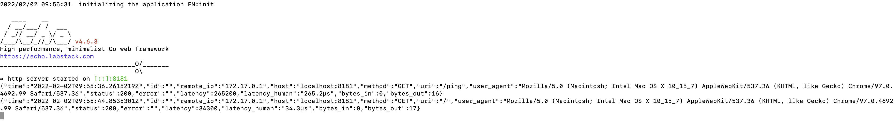
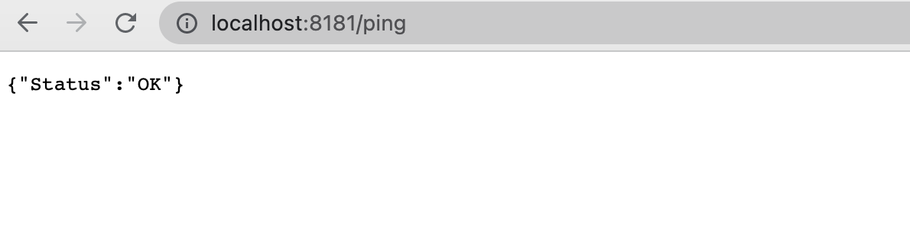

# Simple Rest End point

 Simply runs the docker image

 ```bash
 docker run --env HTTP_PORT=8181 -i -t --rm -p 8181:8181 spinnaker:v1.0
 ```

It uses Echo refer to [easy setup](https://github.com/labstack/echo) as below

> Learn more at [https://echo.labstack.com/guide/](https://echo.labstack.com/guide/)

```bash
package main

import (
  "github.com/labstack/echo/v4"
  "github.com/labstack/echo/v4/middleware"
  "net/http"
)

func main() {
  // Echo instance
  e := echo.New()

  // Middleware
  e.Use(middleware.Logger())
  e.Use(middleware.Recover())

  // Routes
  e.GET("/", hello)

  // Start server
  e.Logger.Fatal(e.Start(":1323"))
}

// Handler
func hello(c echo.Context) error {
  return c.String(http.StatusOK, "Hello, World!")
}
```

## Console

 

 ## Ping

 

# Points to remember

Configrue the secret `docker-registry`

```bash
> k get secret                
NAME                                                     TYPE                                  DATA   AGE
samarthya-docker                                         kubernetes.io/dockerconfigjson        1      20h
```

You can create by using `kubectl create secret docker-registry ...`